# 1984

#domain/literature #pattern/spof #pattern/observability #pattern/coupling #pattern/feedback-loop #pattern/mutable-state

> **in one line:** Oceania is a distributed surveillance system designed to eliminate every failure mode that threatens central authority — including the ability to think a different thought.

## the mapping

The Party runs a control system with a single goal: make defection computationally impossible. Every architectural decision serves that invariant.

- **single point of authority (SPOF by design)** → Big Brother is not a resilience risk — the concentration of power *is* the design. Distributed authority would be the vulnerability, so the system actively eliminates it. The Party is the one node that must never fail, and everything else exists to protect it.

- **distributed observability** → Telescreens are sensors at every endpoint, streaming behavior continuously to the Ministry of Love. There is no dark corner of the system. In a normal system, observability is a debugging aid; here it is the enforcement mechanism.

- **mutable state with no audit log** → The Ministry of Truth's job is to rewrite history so that the current party line was always true. This is the inverse of an append-only immutable log. There is no source of truth outside the live state — no way to diff past against present, no way to detect the rewrite.

- **schema reduction (Newspeak)** → Newspeak shrinks the vocabulary of the language by design. Fewer words means fewer expressible thoughts. This is API surface reduction as a security policy: if the type system cannot represent `freedom`, the concept cannot be called.

- **tight coupling** → Citizens are tightly coupled to the state. There is no private state, no encapsulation, no interface boundary between self and system. Winston's diary is an attempt at encapsulation — a private write-ahead log — and it is what gets him killed.

- **self-correcting feedback loop (doublethink)** → Doublethink is a [[feedback-loop]] installed inside the mind: hold two contradictory beliefs simultaneously, and suppress awareness of the contradiction. The loop runs continuously, correcting any drift toward independent thought before it surfaces. The system does not need to monitor every thought if citizens monitor themselves.

- **tiered access control** → Inner Party → Outer Party → Proles maps directly onto privilege tiers. The Inner Party has write access to reality. The Outer Party executes instructions. The Proles are treated as untrusted, low-priority clients — too numerous to fully monitor, but also too fragmented to coordinate.

- **honeypot** → O'Brien and the Brotherhood are a honeypot: an enticing target designed to surface would-be dissenters. The system does not need to find rebels; it provides a service rebels will seek out, then logs the connection.

## where the analogy breaks down

Real distributed systems optimize for **resilience**: eliminate single points of failure, distribute state, tolerate node loss. Oceania inverts this — the Party is a SPOF by intent, because resilience would mean power could survive without it. Engineering vocabulary has no native concept for a system that deliberately makes itself brittle at the top.

The analogy also flattens the human cost. "Tight coupling" is a maintainability concern in code; in Oceania it is torture and erasure of self. The metaphor makes the horror sound technical and legible, which is useful for analysis but risks making it feel bloodless.

Finally, the system has no actual uptime goal. A real system fails if it goes down; the Party's system fails if it ever *stops* being needed. The threat must be perpetual — war, Goldstein, Prole unrest — because a system with no enemies has no justification. Scarcity of threat is the real vulnerability.

## related

- [[feedback-loop]]
- [[coupling]]
- [[system-design]]
- [[neoliberalism]]
