# abstraction layers

> **in one line:** an abstraction layer hides the messy details of how something works behind a simple interface, so the level above can use it without knowing what's underneath.

## what it is

a system too complex to hold in your head all at once gets sliced into **layers**, each stacked on the one below. every layer offers a clean set of operations to the layer above and, in return, leans on the operations of the layer below — without either side needing to know how the other actually works.

a computer is the canonical stack:

when you click the button, you are (in principle) standing on every layer beneath it, but you only ever think about the top one.

the ideas that make this work:

- **the interface is the contract.** a layer is defined by *what it promises*, not *how it delivers*. as long as the promise holds, everything below it can be rebuilt and nothing above notices.
- **it's a complexity budget.** layering lets you reason about one level at a time. you understand your layer and trust the rest — which is the only way anything large gets built.
- **substitution.** because a layer hides its internals, you can swap the implementation (a different database, a faster algorithm) without disturbing its users.

## where the model breaks down

- **abstractions leak.** *all non-trivial abstractions, to some degree, are leaky* — details you were promised you could ignore (latency, failure, size limits, performance cliffs) eventually surface and force you to understand the layer below after all.
- **layers aren't free.** each one adds indirection, and indirection costs performance and adds places for bugs to hide. a tower of thin layers can obscure more than it reveals.
- **the boundaries are chosen, not given.** where one layer ends and the next begins is a human design decision, not a fact of nature. a bad cut leaves you reaching across layers constantly — a sign the seams are in the wrong place.
- **clean stacking is an ideal.** real systems develop shortcuts and back-channels where an upper layer reaches deep below for speed, quietly [[coupling]] levels that were supposed to be independent.

## related

- [[philosophy]] — its branches read as a stack: metaphysics under epistemology under ethics
- [[science]] — a theory as an abstraction with a documented operating range
- [[turing-machine]] — universality as the layer that lets software run on fixed hardware
- [[coupling]]

#domain/computer-science #pattern/abstraction-layers #pattern/modularity
