# buddhism

> **in one line:** buddhism is an incident postmortem for the mind — it treats suffering as a recurring production failure, traces it to a single root cause, proves the cause is removable, and ships a remediation process — and the deeper you read it, the more it becomes a claim about architecture (there is no god object behind the self) and about scope (fix the whole fleet, not just your own node).



## the mapping

buddhism doesn't open with metaphysics. it opens with a bug report: *something is wrong, and it keeps happening.* its core framework — the four noble truths — is structured exactly like a postmortem, and that structure is what makes the system-design lens fit so naturally. read in order, the four truths are: **symptom → root cause → proof it's resolvable → remediation.**

### the symptom — dukkha

the first truth names the failure. *dukkha* is usually translated "suffering," but that's too narrow; it's closer to **unsatisfactoriness** — the low-grade friction that accompanies even good experiences, because they end, change, or never quite match what was wanted.

in system terms, every experience ships with a small **error term**: the gap between the state the world is in and the state the mind demanded. most of the time it's background latency you've stopped noticing. the first truth's move is simply to *instrument* it — to admit the error is there and measurable rather than pretending the system runs clean.

### the root cause — taṇhā

the second truth is the root-cause analysis, and it makes a sharp claim: the failure is **not** caused by the events themselves. it's caused by *taṇhā* — craving, the demand that things be other than they are.

this only makes sense against two facts buddhism takes as given. first, **impermanence (anicca):** nothing holds still; every state — your mood, your body, your relationships — is being reallocated moment to moment, so there are no permanent values to pin to. second, **no-self (anatta):** the "you" doing the wanting isn't a fixed object either, but a stream of transient states with no stable core.

craving is what happens when the mind ignores both facts. it [[caching|caches a snapshot]] of how things should be and treats reality's constant mutation as an error to be corrected. the suffering *is* that delta — the distance between the pinned cache and a source of truth that has already moved on. and the harder the mind pins it, the tighter it [[coupling|couples]] its own wellbeing to states it doesn't control, so every change in the world cascades straight into a failure inside.

the diagnosis, then, is precise: the bug is in the client, not the server. the world isn't malfunctioning; the clinging is.

```python
# suffering is the gap between a pinned expectation and a moving reality
while alive:
    reality = observe()
    if reality != expectation:         # anicca: reality never holds still
        suffer(reality - expectation)  # dukkha: the size of the delta

    # craving's fix: force reality back to the cached expectation → never ends
    # the path's fix: stop pinning the expectation                 → the loop drains
```

### cessation is possible — nirodha

the third truth is the one a postmortem needs before it's worth writing: **the cause is removable.** if suffering comes from craving rather than from the world, then loosening the craving ends the suffering — not by fixing the world, but by invalidating the stale cache and decoupling from what was never ours to hold. *nirvana* is the name for that resolved state: not shutdown, not numbness, but the system finally **at rest with nothing in the queue** demanding reality be otherwise.

### the remediation — the eightfold path

the fourth truth is the fix, and crucially it's a **process, not a patch.** the eightfold path spans ethics, mental discipline, and wisdom, but two engineering moves anchor it.

**meditation is observability, not intervention.** sitting practice is tracing your own running processes — watching craving and aversion fire *without* acting on them — so you can finally see where suffering is generated instead of hotfixing symptoms blind.

**the path as a whole is a slow refactor toward loose coupling.** each step weakens the binding between self and outcome, so that when external state changes — and it always does — the change no longer propagates into internal failure. it's run continuously, like operational discipline, not deployed once.

## emptiness — no god object behind the self

no-self (anatta) was stated above as a given. **emptiness (śūnyatā)** is what you get when you take it all the way down and ask the architectural question: if there's no fixed self, what *is* there? the answer is the same move at every scale — **decompose the monolith and go looking for the core object that owns everything, and find there isn't one.**

what feels like a single, solid "me" is broken into the **five aggregates (skandhas):** form, feeling, perception, mental formations, and consciousness. these are the running components — the body's hardware, the sensation layer, the labeling layer, the intention/scheduling layer, and the awareness that ties them together. the "self" is not one of these and not a sixth thing behind them; it's the **emergent behavior of the five running together**, the way a "process" is not a thing but the live composition of memory, registers, and state.

- **the five aggregates (skandhas)** → the service decomposition. break the apparent monolith ("self") into the layers that actually do the work. once decomposed, you go looking for the core object that owns them all — and find there isn't one.
- **emptiness (śūnyatā)** → no component has inherent, standalone identity. nothing is a self-contained object with its own essence; each part is *empty of self-nature* because it exists only in relation to other things — maximal [[coupling]] turned into a metaphysics.
- **dependent origination (pratītyasamutpāda)** → dependency injection taken to the limit. nothing is hardcoded; every entity is whatever its conditions wire it to be. remove the dependencies and there is no residue underneath — the identity *was* the wiring.

### form is emptiness, emptiness is form

the heart sutra's signature line — *rūpaṃ śūnyatā, śūnyataiva rūpam* — is a two-way non-duality claim, and each direction blocks a different bug.

**form is emptiness.** the thing you perceive (form) has no inherent self-nature. it's a *view/projection* over conditions, like an [[abstraction-layers|abstraction]] that looks like a solid object but is really a thin interface over churning state underneath. don't mistake the handle for a fundamental entity.

**emptiness is form.** this is the crucial guard clause. emptiness is **not a separate, transcendent layer** sitting beneath or beyond the phenomena. there is no hidden "ground of being" substrate to escape into. emptiness *is exactly these phenomena, correctly seen* — the process is "nothing but" its state transitions, yet it is fully, unreservedly real as a process. the moment you reify emptiness into its own special realm, you've just minted a new god object and missed the point.

together: the abstraction and what it abstracts are **not two**. you don't get to peel the layers and find either a soul at the bottom (*form is emptiness* denies that) or a void that replaces the world (*emptiness is form* denies that).

## compassion — fix the fleet, not just your node

the postmortem so far is a single-node optimization: instrument your own suffering, find the root cause, reduce your own error term. but buddhism's positive value lives one level up — at the **fleet**. **compassion** is that scope change, and it runs two genuinely separate operations.

- **compassion / removing suffering (karuṇā)** → incident response. reactive work: clear the existing outage, drain the pain that's already firing. this is failure-*reduction*, the same objective as the personal postmortem — just pointed at other nodes.
- **loving-kindness / giving joy (maitrī)** → capacity provisioning. proactive work: supply positive wellbeing, new capability, uptime that wasn't there before. this is value-*creation*, a different objective entirely.

the engineering point is that **these don't reduce to each other.** a node at zero errors can still be providing zero value — idle, safe, contributing nothing. removing suffering gets you to a clean baseline; giving joy is the separate operation of building something good on top of it. they are two halves precisely because "fix the outage" and "ship the feature" are two different jobs, and a system that only ever does the first never produces anything worth keeping running.

### the target state — leave suffering, attain joy

"leave suffering, attain joy" is the SLO: migrate from a degraded state to a healthy, value-producing one. *removing suffering and giving joy* is the **operation**; *leaving suffering and attaining joy* is the **target the operation drives toward** — and it applies to oneself and to others identically.

the mahayana escalation is to make that target **fleet-wide**. the bodhisattva vow is a no-node-left-behind commitment: don't fully exit — don't take the clean shutdown of final nirvana — while other nodes are still in a degraded state. it's load-balancing as a moral stance: your own resolved status is not the terminal condition; the whole cluster's is.

and compassion needs emptiness to not curdle. compassion without the wisdom of emptiness collapses into attachment, pity, or burnout — the operator who couples their own wellbeing to every node's status and melts down. wisdom and compassion are meant to run together; emptiness is what keeps the binding to others' states *loose*, so caring scales instead of overloading.

## where the analogy breaks down

- **a postmortem implies a one-time fix.** there's no deploy-and-done here; the practice is lifelong and experiential. you can't ship a patch to the craving subsystem and walk away.
- **no-self is not nihilism.** "the self is just a stream of states" can slide into "so nothing matters," which buddhism rejects. likewise emptiness is "nothing exists *independently*," **not** "nothing exists" — *emptiness is form* exists precisely to block that read. the aggregates are empty *and* fully functional, with real moral weight. the abstraction keeps functioning; the point is to stop *reifying* the handle, not to delete it.
- **the five aggregates aren't a clean layered architecture.** mapping them to tidy, well-separated services imposes far more modularity than the lived stream has; they bleed into each other and aren't a stable stack you can diagram once.
- **nirvana is more than an idle queue.** it's described as a positive liberation, not the mere absence of load. reducing it to homeostasis loses the whole soteriological dimension.
- **compassion isn't a service contract.** an SLA is metered, conditional, and reciprocal; compassion is unconditional and unmetered — it doesn't bill, throttle by tier, or stop when the recipient is ungrateful. and *giving joy* is not delivering pleasure/hedonic hits (which buddhism treats as just more craving to clear), nor is *removing suffering* paternalistic patching — skillful compassion helps others build their own capacity to leave suffering, not hotfix them into dependence.
- **it's meant to be realized, not just parsed.** understanding the decomposition structurally is not the same as *seeing* it (prajñā). the diagram is a pointer to an experiential insight; reading the docs is not running the system.
- **it collapses many traditions into one.** theravada, mahayana, zen, and pure land differ enormously; a single diagram flattens real disagreements.

## related

- [[caching]] — craving as a stale cache the mind refuses to invalidate
- [[coupling]] — attachment as tightly coupling wellbeing to states you don't control; dependent origination as coupling pushed all the way down
- [[abstraction-layers]] — form as a thin interface over churning conditions
- [[feedback-loop]] — craving as runaway positive feedback with no setpoint
- [[stoicism]]
- [[entropy]]
- [[ego]]

#domain/philosophy #pattern/coupling #pattern/caching #pattern/observability #pattern/abstraction #pattern/dependency-injection #pattern/optimization
