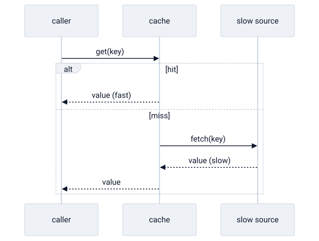

# caching

> **in one line:** a cache is a small, fast copy of data kept close to where it's needed, so you don't pay the full cost of fetching or recomputing it every time.



## what it is

fetching data — from disk, from a database, from across a network — or recomputing an expensive result is slow. a **cache** sidesteps that by keeping a copy of the answer somewhere fast and nearby. the next time you need it, you read the copy instead of redoing the work.

the mechanics are simple and worth knowing because they recur everywhere:

- **hit and miss.** a *cache hit* is when the data you want is already in the cache (fast path). a *miss* is when it isn't, so you fall back to the slow source and usually store the result for next time.
- **staleness.** the cached copy is a *snapshot* taken at some moment. if the underlying source of truth changes, the copy is now **stale** — it no longer matches reality, but the cache doesn't know that.
- **invalidation.** deciding when to throw away or refresh a stale copy. famously hard: *"there are only two hard things in computer science: cache invalidation and naming things."* refresh too eagerly and you lose the speed benefit; too lazily and you serve wrong answers.
- **eviction.** a cache is small, so when it fills up it must drop something. policies like *least-recently-used* (LRU) guess what you're least likely to need again.

in code the pattern is tiny, and the whole idea is visible in it:

```python
def get(key):
    if key in cache:           # hit: pay almost nothing
        return cache[key]
    value = slow_source(key)   # miss: pay full price...
    cache[key] = value         # ...once, then remember it
    return value
```

the whole thing is a single trade: **speed bought with the risk of being out of date.**

## where the model breaks down

- **a cache can quietly lie.** its core failure mode is serving a confident answer that's no longer true. unlike a slow-but-correct source, a stale cache *looks* fine.
- **invalidation has no general solution.** knowing exactly when a copy went stale often requires the very coupling to the source that the cache was meant to avoid.
- **coherence multiplies the problem.** once several caches hold copies of the same thing, keeping them agreeing with each other is a hard distributed-systems problem in its own right.
- **it's not free.** caching adds a layer, more state, and a new class of bugs. for cheap or rarely-reused work it's [[premature-optimization]] — complexity that doesn't pay for itself.

## related

- [[buddhism]] — craving as a stale cache the mind refuses to invalidate
- [[science]] — a theory as a cached approximation, continuously revalidated against reality
- [[coupling]]
- [[abstraction-layers]]

#domain/computer-science #pattern/caching
