# capitalism

> **in one line:** capitalism is a resource-allocation engine built around private ownership of productive capacity and a self-compounding loop — capital buys labor and materials, production generates surplus, surplus reinvests as more capital, each cycle amplifying the position of whoever already holds the most.



## the mapping

capitalism is not just "markets" or "trade," both of which predate it by millennia. its specific claims are: **(1)** the means of production are privately owned; **(2)** labor is a commodity purchased in a market; **(3)** the goal of deployment is surplus — M' > M. everything else — prices, competition, wages, finance — is infrastructure built on top of those three claims.

### capital — the deployable resource pool

capital is **accumulated productive capacity** that can be directed at a task: factories, equipment, patents, trained teams, infrastructure. owning capital is holding the server rack, not just cash to rent time on someone else's. this distinction matters because capital begets capital — you don't just spend it, you deploy it to generate more.

the capitalist is whoever controls that productive capacity. the worker is whoever owns only their own labor-time and must sell access to it.

### the core loop — M → C → M'

the fundamental unit of capitalist activity is not an exchange but a **cycle**. money (M) is advanced to purchase commodities (C) — raw materials plus labor power. these are combined in production and the output is sold for M', more money than started. the surplus — M' minus M — is the engine's output and its fuel.

```python
capital = initial_investment
while operating:
    labor = hire(workers)                       # buy labor-time at wage rate
    materials = buy(inputs)
    output = produce(labor, materials)
    revenue = sell(output)
    surplus = revenue - (labor + materials)     # extraction: gap between wage and value added
    capital += reinvest(surplus)                # M' → M: compounding
    # workers received their wage; surplus accrues to the capital-owner
```

the surplus arises from the gap between what workers are paid (their wage) and the value their labor adds to the output. that gap is the system's operating margin, and it is what makes M' > M structurally, not incidentally.

### ownership as access control

private ownership of the means of production is the **root permission**. the owner decides: what to produce, how, whom to hire, what to pay, where to reinvest. workers contribute labor — CPU time — and receive wages in return. but they hold no root permission, no stake in the surplus, no claim on the server rack after their shift ends.

this asymmetry is why capitalism and [[neoliberalism]] overlap but are not identical. neoliberalism is an argument about *how to coordinate* (via markets over planners). capitalism is an argument about *who owns the nodes* and what the loop produces. you can have markets with collective ownership (market [[socialism]]); what makes capitalism distinctive is private ownership combined with the surplus-extraction cycle.

### competition — the optimizer and its failure mode

multiple capital-owners competing for the same market creates selection pressure: inefficient firms lose customers and capital, efficient ones grow. [[feedback-loop|profit and loss are the error signal]]; investment is the control output.

but competition is self-destructive over time. a winning firm can underprice competitors until they exit, acquire them, or lock in network effects that make the mesh collapse toward a [[spof|single dominant node]]. monopoly is not an aberration of capitalism — it is a natural terminus of the accumulation loop, because scale advantages are real and compounding.

### accumulation dynamics — positive feedback with no ceiling

because surplus is reinvested as capital, ownership concentrates over time. whoever starts with more capital generates more surplus, which becomes more capital. this is a **[[feedback-loop|positive feedback loop]] with no built-in ceiling**: r > g (piketty's formula) says returns to capital tend to grow faster than the overall economy. the distributional result isn't an accident of policy; it's the expected output of the loop when left unconstrained.

the feedback is further amplified by incumbency: existing capital buys better legal representation, cheaper inputs at volume, and political access that shapes the rules in its favor. the competition that was supposed to discipline incumbent power finds itself outspent before the race starts.

## where the analogy breaks down

- **capital isn't compute you can reprovision.** a factory embeds specific geography, social relationships, and knowledge. "destroying unproductive capital" during a recession means shuttered towns and unemployed families, not just spinning down a VM. the human cost doesn't appear in the accumulation model.
- **the market signal is lossy.** profit tracks what buyers can pay, not what society needs. environmental costs, public health, future generations — none of these enter the price unless forced in by regulation. the loop optimizes a proxy metric; push it hard enough and it diverges from actual welfare. see [[neoliberalism]] for the extended version of this failure.
- **labor is not a commodity like other inputs.** you can't separate a worker from their labor-time; selling a shift is selling a slice of a human life. the "labor market" framing makes exploitation legible as a clearing price while erasing what's specific to persons.
- **efficiency doesn't imply equity.** M-C-M' is efficient in the sense of growing capital. but it compounds whatever endowment the system starts with. efficient allocation from an unequal starting point reproduces and amplifies that inequality. the model has no native correction for this.
- **the loop generates crises.** overproduction, underconsumption, credit expansion and contraction — capitalism produces recurring system crashes that the clean compounding model doesn't predict. losses socialize during crashes; profits accumulate privately during the upswing.

## related

- [[neoliberalism]] — the market-coordination argument that often accompanies capitalism but is conceptually separable
- [[socialism]] — the alternative ownership architecture designed to break the private accumulation loop
- [[feedback-loop]] — profit/loss as the error signal; accumulation as runaway positive feedback
- [[coupling]] — capital ownership tightly couples returns to whoever holds the root permission
- [[1984]] — what accumulation of political rather than economic capital produces at the limit

#domain/economics #pattern/feedback-loop #pattern/spof #pattern/coupling
