# christianity

> **in one line:** christianity is a salvation protocol — every human process carries a permission error it cannot self-patch; the system resolves it through a root-level mediator who absorbs the fault once, so that authorized access becomes available through grace rather than earned credentials.



## the mapping

christianity opens with a diagnosis: the relationship between humans and God is broken, and the break is structural. it isn't that individual people are failing hard enough — it's that the permission error is baked into the base image. the system-design frame that fits most naturally is **authentication and authorization**: there is a resource (communion with God) that requires credentials no human can self-generate, and the entire theological architecture is a solution to that problem.

### the original fault — a baked-in permission error

christian theology begins with the fall: humanity begins in right relationship with God and then breaks it. but the break doesn't just affect the original actors — it propagates to every subsequent instance. **original sin** is a default state every process inherits: not a mistake you made, but a corrupted image you booted from. the problem isn't individual transactions; it's the root of the stack.

this matters architecturally because it means the fix can't be local. you can't patch individual instances one at a time. the fault is in the base layer, so the fix has to touch the base layer.

### the fix — a mediating proxy

the incarnation is the fix. Christ enters the system as a human — sharing the image — but without the inherited fault. the crucifixion and resurrection are the mechanism: the accumulated debt is absorbed by the mediator, the death is the clearing event, and the resurrection proves the mediator held. authorization is now available, routed through this proxy.

```python
# before: direct call fails
def access_god(human):
    if has_permission(human):   # every human fails this check
        return communion()
    raise PermissionError("original sin")

# after: mediated call succeeds
def access_god_via_mediator(human):
    if trusts(human, christ):   # faith as the session mechanism
        return christ.proxy_to_god(human)
```

the authorization is not earned on a per-call basis. it is extended once by the mediator and held open. that's what **grace** means structurally: the credential is a gift, not a payment.

### grace vs works — declarative vs imperative justification

the central dispute of the reformation was precisely this: is salvation **declarative** (you are declared righteous through faith alone) or **imperative** (you must accumulate righteousness through acts)?

luther's break with rome was an argument about the authorization model. the roman system had developed an economy of merits — prayers, indulgences, sacraments — that functioned like a score accumulator. luther's reading of paul is that this is architecturally wrong: the credential *cannot* be earned, only received. the protestant formula — *sola fide*, faith alone — claims that justification is declarative rather than computed from a merit score.

### the church as platform

the church is the middleware that keeps individual instances connected to the mediator. the **sacraments** are stateful transactions: baptism initializes the session, the eucharist maintains it, confession resets state after failure. reformation debates about sacraments are largely disputes about whether the middleware layer is necessary or whether the client can connect directly.

the **canon** — scripture — is the api documentation: the authorized spec for what the protocol guarantees and how to use it. canon debates are versioning disputes about which texts belong in the official spec.

### the trinity — distributed coherence with no clean model

the doctrine of the trinity insists that Father, Son, and Spirit are three distinct persons who are also fully one God. a tempting reading is "one substrate, three roles" — but the councils called that **modalism** and rejected it. "three services" is **tritheism**, also rejected. what the councils insisted on is something that resists every architectural metaphor: three co-equal, co-eternal, fully distinct persons sharing one essence without division. the formula was hammered out precisely *because* every simple model was wrong.

### eschatology — scheduled shutdown

the second coming is not the system running indefinitely into entropy. christianity insists the current runtime ends deliberately, followed by resurrection and judgment. the world has a shutdown/restart point that is announced, not gradual. the new creation is not a patch to the current system but a full rebuild on a fixed foundation.

## where the analogy breaks down

- **grace is not a system patch; it is a personal relationship.** the mediator is not a gateway that routes traffic; christianity insists he is a person who *loves*. reducing salvation to an authorization mechanism misses the entire relational register. the protocol is not the point — the relationship is.
- **the trinity resists every architectural metaphor.** "one substrate, three processes" is modalism. "three services" is tritheism. the councils rejected every clean model precisely because the doctrine isn't reducible to a topology.
- **works matter; they're just not the source of justification.** "grace only, no works" can sound like behavior is irrelevant. most christian traditions say works are the *output* of a regenerated process — the ethics of love and service are not optional modules.
- **the framing flattens vast internal diversity.** catholicism, eastern orthodoxy, protestantism, evangelical, pentecostal, and liberation theology disagree sharply on authority, sacraments, and social ethics. "christianity" is a family of traditions, not a single deployable system.
- **salvation as future verdict misses the present-tense register.** many traditions (especially orthodox) understand salvation as ongoing *theosis* — participation in divine life beginning now — not just a final authorization grant stored for later.

## related

- [[abstraction-layers]] — the mediator as a layer that resolves what neither side can reach directly
- [[coupling]] — the incarnation as tight coupling between divine and human, deliberately chosen
- [[neoliberalism]] — the state-as-platform framing mirrors the church-as-middleware structure
- [[judaism]]
- [[islam]]
- [[philosophy]]

#domain/religion #pattern/mediation #pattern/abstraction #pattern/versioning
