# coupling

> **in one line:** coupling is how much two parts of a system depend on each other — how much a change in one forces a change in, or breaks, the other.

## what it is

build anything out of parts and you have to decide how those parts connect. **coupling** measures the strength of that connection: when part A is *tightly coupled* to part B, you can't touch B without understanding and probably changing A. when they're *loosely coupled*, each can change, fail, or be replaced on its own as long as the agreement between them — the **interface** — holds.

the usual moves:

- **interfaces decouple.** if A talks to B only through a stable contract (a function signature, an API, a protocol), B's insides can change freely. the contract absorbs the change so it doesn't propagate. the interface is the seam.
- **why loose coupling is prized.** parts can be developed, tested, deployed, and reasoned about independently. one can fail without dragging the others down with it.
- **the failure mode of tight coupling is the cascade.** when wellbeing-of-A is wired directly to state-of-B, a change or failure in B propagates straight into A, and onward — a small local problem becomes a system-wide outage.
- **cohesion is the complement.** the goal isn't *no* connections — it's keeping related things together (high cohesion) and unrelated things apart (low coupling).

## where the model breaks down

- **some coupling is irreducible.** parts that genuinely must cooperate have to depend on *something* shared. you can move coupling around — onto an interface, a schema, a protocol — but you can't delete it. "zero coupling" usually means the parts aren't actually working together.
- **decoupling has a cost.** every layer of indirection added to loosen a connection is one more thing to understand and maintain. chase loose coupling too hard and you get [[premature-optimization]]: a maze of interfaces hiding what's really a simple, direct dependency.
- **"loose" can hide real dependencies.** two components with no explicit link can still be secretly coupled through shared data, timing, or assumptions — coupling you can't see is worse than coupling you can.

## related

- [[buddhism]] — attachment as tightly coupling your wellbeing to states you don't control
- [[philosophy]] — its branches coupled bidirectionally rather than cleanly stacked
- [[caching]]
- [[abstraction-layers]]

#domain/computer-science #pattern/coupling
