# currying

> **in one line:** currying turns a function of many arguments into a chain of single-argument functions — so `f(a, b, c)` becomes `f(a)(b)(c)`, where each call swallows one argument and hands back a function still waiting for the rest.



## what it is

named after the logician haskell curry. take a function that wants three arguments at once. **curry** it and you get a function that takes the *first* argument and returns a new function — one that takes the *second* and returns yet another, which finally takes the *third* and produces the answer. the work is the same; the *shape* is a chain.

```python
def add(a, b, c):                         # takes all three at once
    return a + b + c

def add(a):                               # curried: one argument at a time
    return lambda b: lambda c: a + b + c

add(1)(2)(3)   # 6  — three calls, each handing one argument down the chain
```

### partial application — the payoff

because each step *returns a function*, you don't have to supply every argument at once. you can stop partway and keep the half-finished function around. `add(1)` is a perfectly good value: a function that will add 1 to whatever two numbers come later. fixing some arguments now and the rest later is **partial application**, and it's how you specialize a general tool into a specific one:

```python
add_ten = adder(10)     # bake in the first argument
add_ten(5)              # 15 — the rest arrives later
```

one general `adder` becomes a family of specific functions (`add_ten`, `add_one`, …) just by feeding it different first arguments. it's the same instinct as setting a default in a config and shipping the specialized result.

### why it exists at all — one argument is enough

currying isn't just a trick; in some worlds it's the *only* way multi-argument functions exist. in [[lambda|lambda calculus]] every function takes **exactly one argument** — there is no syntax for two. so a "two-argument" function is really a one-argument function that returns another one-argument function. currying is how arity greater than one is *possible* there at all. haskell makes this its default: the type `Int -> Int -> Int` is silently `Int -> (Int -> Int)` — a function returning a function, curried by construction, so partial application just works everywhere without anyone asking for it.

## where the model breaks down

- **it adds no power, only shape.** curried and uncurried forms compute the identical result; in most languages currying is pure ergonomics, not new capability. dressing it up as profound oversells a syntactic rearrangement.
- **currying is not the same as partial application,** though they're constantly confused. currying *always* produces a chain of strictly one-argument functions; partial application just means fixing *some* arguments of a function and leaving the rest. you can partially apply without currying, and the conflation hides what each actually does.
- **variadic and unknown-arity functions resist it.** currying needs to know how many arguments are coming. a function that takes `*args` — any number of them — has no fixed chain length to unfold into, so it doesn't curry cleanly.
- **it costs allocations.** a chain of nested functions builds a closure at every step. in languages not built around it, that's real overhead compared to one flat call — a price paid for the flexibility.
- **point-free cleverness can wreck readability.** deeply curried, argument-free "point-free" style can collapse into an unreadable pipeline where no variable is ever named. the abstraction stops paying for itself when the reader can no longer see what flows where.

## related

- [[lambda]] — currying is native to lambda calculus, where every function is unary and currying is the only way to take more than one argument
- [[abstraction-layers]] — partial application as carving a specific interface out of a general one by fixing arguments
- [[system-design]] — pre-binding configuration into a specialized component is partial application in the large
- [[coupling]] — currying lets a caller supply arguments at different times, loosening *when* each input must be known

#domain/computer-science #pattern/abstraction #pattern/interface
