# feedback loop

> **in one line:** a feedback loop is when a system feeds its own output back into its input, so it can steer toward a target — or spiral away from one.



## what it is

a system with a feedback loop *watches its own results and reacts to them.* it measures where it is, compares that to where it's supposed to be, and uses the difference to decide what to do next. that difference — the **error signal** — is the whole engine. the two flavors behave in opposite ways:

- **negative feedback — self-correcting.** the loop pushes *against* the error, shrinking the gap to a target. a thermostat is the textbook case: too cold → heat on, too warm → heat off. negative feedback is what makes a system **stable** — it settles toward a setpoint and stays there.
- **positive feedback — self-reinforcing.** the loop *amplifies* its own output, so each cycle feeds the next. this is runaway behavior: compounding interest, a microphone screech, a viral share. no setpoint — just acceleration, until something outside the loop stops it.

the key parts are the **setpoint** (the target), the **measurement** (what's actually happening), the **error** (the gap), and the **correction** (the response). the sign of that correction is the whole story:

```python
error = setpoint - measure()
output += gain * error       # negative feedback: shrinks the gap   → stable
# output += gain * output    # positive feedback: feeds itself      → runaway
```

change the strength of the response — the *gain* — or how fast it arrives, and the loop's character changes completely.

## where the model breaks down

- **delay turns stabilizing into destabilizing.** if the correction arrives too late, the system overshoots, corrects too hard the other way, and **oscillates** — the same negative-feedback loop that should settle instead swings wildly. timing matters as much as direction.
- **positive isn't "bad," negative isn't "good."** the names are mechanical, not moral. positive feedback drives growth and learning; negative feedback can trap a system in a rut. which one you want depends entirely on the goal.
- **not everything has a setpoint.** the model assumes a clean target to steer toward. many real systems have shifting, contested, or no well-defined goals, and then "the error signal" is undefined.
- **loops interact.** real systems are tangled webs of loops fighting and reinforcing each other, where isolating "the" feedback loop is already a simplification.

## related

- [[science]] — the scientific method as a feedback loop correcting models against reality
- [[buddhism]] — craving as a positive-feedback loop with no setpoint
- [[coupling]]

#domain/engineering #pattern/feedback-loop #pattern/control
