# immanuel kant

> **in one line:** kant relocates the structure of reality from the world into the mind's processing pipeline — you never read raw reality, only the rendered output of a fixed format your mind imposes on everything before you can experience it.



## the mapping

before kant, the default assumption was that **the mind conforms to objects:** there's a ready-made world out there, and knowing it means getting your mind to mirror it. the world is the server holding the schema; the mind is a client trying to match it. kant inverts this — his self-described **Copernican revolution**: objects conform to the mind. the structure we find in experience — space, time, cause and effect — isn't read off the world; it's imposed by the equipment doing the reading. **structure lives in the processing layer, not the source.** once you make that move, his system falls out as a description of the pipeline.

### the raw source you can't read — phenomena vs noumena

the thing-in-itself — the **noumenon** — is the source data: whatever reality is independently of any observer. you never reach it. every scrap of experience has already been processed, formatted by your faculties before it ever reaches awareness. what you actually get is the **phenomenon**: the rendered output, the only thing on your screen. the noumenon is the database you have no direct query access to — you only ever see the view the middleware returns. and this isn't a temporary limit better instruments could lift: to experience anything *at all* is to receive it already formatted. there is no "raw" mode.

### the fixed input format — space, time, and the categories

the format has two stages. first the **forms of intuition**, space and time: not things you find out in the world but the coordinate system every sensory input is automatically laid out in — the canvas, not the paint. then the **categories of the understanding** — causality, substance, unity, plurality, and the rest — a fixed set of structuring operations that organize the raw manifold into objects standing in relations. causality is the clean example: you never *observe* a cause, you *impose* one. it's a constraint the pipeline enforces on every input so that what comes out is a law-governed world of objects rather than a slideshow of disconnected sense-data.

```python
experience = understanding(categories, sensibility(space, time, noumenon))
#            you only ever hold `experience`; `noumenon` is never in scope
```

### knowing the spec without running it — the synthetic a priori

here's the payoff. because the same format is applied to *every* possible input, you can know things about all future experience in advance — not by surveying the world but by reading off the spec of your own pipeline. "every event has a cause," and the truths of geometry, are **synthetic a priori**: substantive claims about the world that you can nonetheless know before any experience, because they're guaranteed by the format the mind will impose no matter what the source sends. you're not discovering facts about reality; you're stating the preconditions of your own rendering. that's kant's explanation for why mathematics and newtonian physics feel *necessary* and *universal* — they're specs of the processor, not findings about the source.

### the same move in ethics — the categorical imperative

kant runs the identical play in morality: the law comes from the structure of the rational agent, not from outcomes in the world. the **categorical imperative** — *act only on a maxim you could will to be a universal law* — is a **universalizability check**: would this rule still function if every agent ran it? "break promises when convenient" fails not because it leads to bad consequences but because it's **self-undermining at scale** — if everyone ran it, the practice of promising collapses and the maxim can't even be stated. it's a consistency test on a protocol: does it survive universal adoption, or does it only work as long as you're the free-riding exception? and "treat humanity always as an end, never merely as a means" says rational agents aren't mere resources for another process to consume — they're ends in themselves. epistemology and ethics make the same architectural bet: **the law is in the structure of the subject, not out in the world.**

## where the analogy breaks down

- **you can't coherently talk about the source at all.** the pipeline picture wants noumena to be "the real data behind the view." but existence and causation are themselves *categories* — parts of the format — so strictly you can't even say the noumenon *exists* or *causes* the phenomenon without illegally using the schema outside its domain. kant is perpetually accused of reaching past his own wall to point at what's behind it. the honest version is starker than hidden source data: there is nothing you can say about it whatsoever.
- **the format turned out to be revisable.** kant thought the spec was fixed and universal for every rational being — and he hardcoded *euclidean* space, *absolute* time, and newtonian causality into it. relativity and non-euclidean geometry broke exactly those assumptions. what he took for the immutable hardware spec looks more like the firmware of one era mistaken for eternal — the [[science]] paradigm-shift problem: he versioned the wrong thing as permanent.
- **relocating all structure to the subject threatens to lose the world.** if everything we can talk about is our own construction, it gets hard to say the rendering is *about* anything — idealism slides toward "we only ever know our own outputs," and the source drops out as idle. his successors spent a century fighting over whether the noumenon should be there at all.
- **the universalizability check underdetermines morality.** as a pure consistency test it both passes things it shouldn't (cruel maxims that universalize without contradiction) and fails things it shouldn't (trivial or unlucky maxims that generate spurious contradictions). checking whether a rule self-contradicts is **well-formed, not right** — the same gap a type checker has: it certifies the moves are legal, not that the program is good. compare logic in [[philosophy]] as the type checker that says nothing about whether the premises are true.
- **the processor has no accessible implementation.** the metaphor implies something doing the synthesizing, but kant says the self that runs the pipeline — the transcendental ego — is itself only ever known as appearance. there's no observable processor to inspect, just the processing. you can't open the box.

## related

- [[abstraction-layers]] — the mind as the only layer you can access; reality-in-itself sits below it, unreachable
- [[descartes]] — kant's answer to him: stop trying to *verify* the external world, and ask instead what the subject must contribute for experience to be possible at all
- [[science]] — the synthetic a priori as the spec newtonian physics ran on, later versioned out by relativity
- [[philosophy]] — the epistemology layer, reframed around what the knower supplies
- [[wittgenstein]] — another thinker who put the structure of thought somewhere other than the world

#domain/philosophy #pattern/abstraction-layers #pattern/interface
