# medallion architecture

> **in one line:** medallion architecture is a data lakehouse design pattern that routes all data through three progressively cleaner quality tiers — bronze (raw), silver (cleaned), gold (aggregated) — so that messy source reality is contained at the edge and every downstream consumer gets exactly the level of refinement they need.



## what it is

when data arrives from the outside world — event streams, API feeds, database replicas, uploaded files — it is messy: missing fields, duplicate records, inconsistent types, schema drift. medallion architecture is an organizing principle for a data lakehouse that says: **don't sanitize at the edge; ingest everything raw, then refine in hops**. each hop adds quality without discarding history.

### bronze — raw ingest, append-only

bronze is the landing zone. data is written exactly as received: no type coercion, no deduplication, no schema enforcement beyond what's strictly necessary to store it. the defining rule is **append-only** — records are never updated or deleted. bronze is the source-of-truth checkpoint: if silver or gold are ever corrupted or their logic changes, you replay from bronze. it's the audit log for the entire pipeline.

### silver — cleaned and conformed

silver applies the first real logic: deduplicate records, enforce types, join to reference data (dimension tables, lookup codes), validate against schemas, and standardize timestamps and keys. silver is fit for *analysis* — an engineer or data scientist can query it without first writing defensive parsing code. the silver layer is where [[coupling]] between the pipeline and source messiness is broken: upstream schema changes are absorbed here so they don't ripple into gold.

### gold — business aggregates

gold contains domain-shaped tables: KPI rollups, ML feature stores, pre-joined reporting views, per-product metrics. each gold table is built for a specific consumer — the BI dashboard, the ranking model, the finance report. gold is [[caching|a materialized cache]]: it stores the result of expensive aggregations so consumers get sub-second queries instead of re-running heavy joins every time.

```python
# bronze: raw event as received — messy, but complete
{"user_id": "abc", "ts": "2024-01-03T08:12:00Z", "event": "purchase", "amt": "49.99", "amt": "49.99"}

# silver: cleaned — deduped, typed, validated
{"user_id": "abc", "ts": datetime(2024, 1, 3, 8, 12), "event": "purchase", "amount_usd": 49.99}

# gold: aggregated for a specific consumer
{"user_id": "abc", "month": "2024-01", "purchase_count": 3, "total_usd": 149.97}
```

### reprocessing flows downward, never upward

because bronze is never mutated and silver/gold are derived, you can always rebuild: fix silver logic and replay bronze → silver → gold. the dependency arrow points one way — gold depends on silver depends on bronze — and that direction is the invariant that makes the whole system trustworthy. it's the same rule as [[clean-architecture|clean architecture's dependency rule]], applied to data quality rather than code layers.

## where the model breaks down

- **three tiers is a simplification.** real lakehouses often have four or five hops — a "bronze-plus" quarantine for malformed records, a "silver-plus" join layer before aggregation. the names are conventions, not law; the actual graph can be a DAG with many intermediate materialization points.
- **bronze is never truly raw.** ingestion always involves choices: file format, partitioning strategy, encoding, batching window, late-arrival handling. the "exact copy of the source" ideal collides with the reality that you're already imposing structure just by deciding *how* to store it.
- **gold sprawl is the dominant failure mode.** because gold tables are tailored to consumers, they multiply. teams add new gold tables; old ones are never retired. over time the gold layer becomes a tangle of overlapping, inconsistently defined metrics — the same "revenue" calculated four different ways in four tables. what starts as consumer-friendly ends as the next mess to clean up.
- **the append-only guarantee breaks at scale.** GDPR and CCPA require that personal data can be deleted ("right to erasure"). append-only bronze survives this only with specific tombstone mechanics (Delta Lake deletion vectors, Iceberg row-level deletes) — and those are non-trivial. the architectural purity of "never touch bronze" is a legal liability without deliberate design.
- **streaming pipelines don't fit cleanly.** the model was designed for batch. a streaming bronze-to-silver-to-gold pipeline has to reason about windows, watermarks, and out-of-order events at every hop, and the clean "replay from bronze" story becomes complicated when bronze is a Kafka topic with a retention window, not an eternal file store.

## related

- [[abstraction-layers]] — bronze/silver/gold as quality layers that hide source messiness behind progressively cleaner interfaces
- [[caching]] — gold as a materialized cache of expensive aggregations; bronze as the durable checkpoint
- [[coupling]] — silver as the decoupling point that absorbs source schema changes before they reach consumers
- [[clean-architecture]] — the dependency rule (gold → silver → bronze, never upward) mirrors the clean architecture invariant
- [[spark]] — the typical execution engine for medallion pipelines; Delta Lake and Apache Iceberg are the storage formats that enforce bronze's append-only and ACID guarantees

#domain/computer-science #pattern/abstraction-layers #pattern/caching #pattern/coupling
