# neoliberalism

> **in one line:** neoliberalism is the argument that economic coordination should run as a decentralized protocol instead of a central server — that the price system scales where central planning hits a knowledge bottleneck.



## the mapping

strip neoliberalism down and the load-bearing claim is **architectural, not moral**: a market coordinates a society better than a state can, because of *how the two are wired*. one is a star topology with a single node in the middle; the other is a mesh with no center. everything else — deregulation, privatization, free trade — is deployment detail that follows from preferring the second design. read it as four layers: the argument for the architecture, the runtime it still needs, what gets shipped on top, and the mechanism that's supposed to make it self-improving.

### the core argument — prices as a distributed protocol

the foundational move comes from hayek's *knowledge problem*. to allocate resources well you'd need to know millions of facts at once — every preference, every shortage, every local trick for making a thing cheaper. that knowledge is **dispersed**: it lives in the heads of the people on the spot and changes by the second. no central node can gather it in time. the planner is a **bottleneck that can't scale** — by the time the survey is in, the data is stale.

the price system is the workaround. a price is a single number that **compresses all of that dispersed knowledge into one signal** every actor can read locally and act on without understanding the whole. a frost in brazil pushes the coffee price up; a barista in oslo cuts back, having no idea why. the information propagated without anyone holding the global picture. it's message-passing, not central command:

```python
# central planning: one node must hold the entire world's state to decide
def plan(all_preferences, all_resources, all_techniques):  # gather everything...
    return allocate(...)        # ...intractable; the state never fits in one node

# the price system: each actor reacts to one number, locally
def actor(my_local_state, price):
    if price > my_cost: produce_more()   # no global knowledge required
    else:               pull_back()
# the global allocation *emerges*; no node ever computed it
```

this is why the diagram's contrast is the whole thesis: the planner is a [[spof|single point of failure]] and a throughput ceiling; the mesh has neither.

### the runtime — the state as platform, not player

the common caricature is that neoliberalism wants government gone. it doesn't. it wants the state to **stop being a node in the market and become the platform the market runs on**. property rights, enforceable contracts, stable money, courts — these are the protocol layer: the guarantees without which no peer can trust a price or a trade. neoliberal thinkers wanted a *strong* state for exactly this, narrowly scoped. the slogan isn't "no rules," it's "the state maintains the runtime; it does not run the application." that's a real distinction from pure laissez-faire — markets here are **constructed and defended infrastructure**, not a state of nature you reach by removing government.

### the deployment — what actually ships

given that architecture, the policy program is a set of migrations off the central server:

- **deregulation** — remove the rate limits and constraints the state imposed on the market, on the theory they were throttling a system that self-regulates through prices.
- **privatization** — move a service out of the state monolith and expose it to competing market implementations. a state-run utility becomes a swappable provider behind a price.
- **free trade** — open the network at the borders. tariffs and quotas are protocol barriers between national meshes; removing them lets price signals route globally.
- **fiscal discipline** — keep the platform layer (the state's own balance sheet) lean so it doesn't distort the signals it's supposed to merely host.

### the mechanism — competition as the optimizer

the reason any of this is supposed to *improve* outcomes, not just decentralize them, is competition. a market is a [[feedback-loop]]: profit and loss are the error signal, and competition is the selection pressure that kills inefficient allocations and rewards efficient ones. privatization isn't just moving a box on the org chart — it's **exposing a protected service to that optimizer** so the loop can act on it. the claim is that decentralized search by millions of self-interested agents hill-climbs toward efficient allocation faster than any planner could compute one.

## where the analogy breaks down

- **the optimizer maximizes a proxy.** price and profit are a *measurable stand-in* for human welfare, not welfare itself. optimize a proxy hard enough and it diverges from the real goal — goodhart's law. anything the price doesn't capture is invisible to the loop: pollution, depleted commons, the value of things nobody is billed for. these **externalities** aren't edge cases the model handles badly; they're inputs it structurally cannot see, so the optimizer will happily destroy them while reporting success.
- **the "decentralized" system concentrates.** markets left alone produce monopolies — returns to scale and network effects make the mesh collapse back toward a star. the supposedly distributed design regrows the very central nodes it was meant to avoid, except now they're private and unaccountable ("too big to fail" is a [[spof|single point of failure]] that the architecture was supposed to have eliminated).
- **not everything behaves as a commodity.** the protocol assumes goods that price cleanly and buyers who can comparison-shop. health, education, and a stable climate violate those assumptions badly — turning them into markets can degrade the thing rather than allocate it well.
- **the compression is lossy.** a price aggregates *willingness to pay*, which is weighted by who has money. the signal faithfully transmits the demand of the wealthy and quietly drops the needs of the poor — so "the market cleared efficiently" can coexist with people going without. the protocol is working as designed; the design encodes a distribution most of its defenders don't state out loud.
- **it presents a political project as a neutral mechanism.** framing all of this as pure systems engineering hides the question *cui bono* — who the migration off the public balance sheet actually enriched. "this is just how coordination scales" is itself a move in the argument, not a fact outside it.

## related

- [[feedback-loop]] — competition and profit/loss as the market's error signal
- [[abstraction-layers]] — a price as an interface that hides how a good was produced
- [[coupling]] — central planning tightly couples every actor to one node; the mesh loosens it
- [[science]]
- [[philosophy]]
- [[liberal-arts]]

#domain/economics #pattern/decentralization #pattern/feedback-loop #pattern/spof
