# philosophy

> **in one line:** philosophy is the base layer of the knowledge stack — the kernel every other discipline imports without re-examining, and the monolith that spins off new sciences once their interfaces stabilize.

each layer presupposes the one below it.

## the mapping

every field rests on assumptions it doesn't itself test: what counts as evidence, what kinds of things exist, what makes an inference valid. the physicist assumes the external world is real and measurable; the historian assumes testimony can be weighed; the mathematician assumes the rules of inference hold. **philosophy is the layer that works on those assumptions directly.** it isn't another application competing in the same problem space — it sits underneath, maintaining the runtime the others execute in. its main branches are the components of that layer, and they stack like [[abstraction-layers|abstraction layers]]:

### the data model — metaphysics

before you can compute over the world, you need a model of what's in it. **metaphysics specifies the schema:** what entities exist, how they relate, what causation and time and identity actually are. it's the lowest layer because every other claim presupposes some answer to "what kind of thing are we even talking about." most disciplines inherit this schema silently; metaphysics is where it gets written down and argued over.

### the validation layer — epistemology

given a schema, which inputs do you trust? **epistemology is the trust model:** what counts as a credential for belief, how a claim gets authenticated, where the boundary runs between justified knowledge and noise. every method in every science is, underneath, a bet on some epistemology — and when two fields disagree about what evidence even means, they're really disagreeing one layer down, here.

### the type system — logic

**logic is the compiler's type checker.** it verifies that an inference is well-formed independent of content: a valid argument is a well-typed program, a fallacy is a type error caught before runtime. it doesn't tell you whether the premises are true any more than a type system tells you your code is correct — it only guarantees the moves between them are legal.

### the policy layer — ethics and politics

once you have facts, what should be done with them? **ethics is the authorization layer:** given a state of the world, which actions are permitted, required, forbidden. **politics scales that policy to a distributed system** — many agents, contested resources, the question of what makes an authority's decisions legitimate rather than merely enforced.

### spinning services off the monolith

here's the part that makes philosophy look strange from the outside. historically it behaves like **a monolith that keeps extracting modules.** physics was "natural philosophy." psychology, economics, and linguistics all began inside philosophy. logic, pushed far enough, became computer science. each split off the moment it developed a stable, independent method — a repeatable empirical or formal interface it could run on its own.

what stays behind in "philosophy" is therefore, by construction, the set of questions that *don't yet* (or *can't*) reduce to a measurable method. this is why philosophy looks like it never makes progress: it's a selection effect. the instant a question becomes answerable by a repeatable procedure, we stop calling the work philosophy and give it a new name.

## where the analogy breaks down

- **the spin-off story frames the residue as failure.** "everything answerable left, so what remains is unsolved" implies philosophy is just a waiting room. but some of its questions — consciousness, meaning, what's good — may be permanently non-empirical rather than immature. they aren't bugs awaiting a method.
- **a base layer is supposed to be stable; this one is the most contested.** you import a kernel and stop thinking about it. philosophy's entire job is to *not* stop — its foundations are perpetually re-opened, so calling it a settled, importable layer gets it backwards.
- **the layers aren't cleanly stacked.** ethics can constrain what metaphysics you'll accept; epistemology feeds back into logic. the real [[coupling]] is bidirectional, not a clean bottom-up dependency tree.
- **it instrumentalizes philosophy as infrastructure for other fields.** framing it as "the runtime the sciences run on" hides that it has intrinsic aims — wisdom, the examined life — that aren't in service of anything downstream.

## related

- [[abstraction-layers]] — the branches read as a layered stack
- [[coupling]] — why those layers aren't cleanly stacked
- [[liberal-arts]]
- [[buddhism]]
- [[science]]

#domain/philosophy #pattern/abstraction-layers #pattern/modularity #pattern/coupling
