# science

> **in one line:** science is test-driven development against reality — you can't read reality's source code, so you write models, run experiments to find where they fail, and keep only what hasn't broken yet.



<sub>green just means "no failing test yet" — the loop never terminates.</sub>

## the mapping

science isn't a body of facts; it's a **process for locating where your model of the world is wrong.** the facts are a cache of results; the method is the loop that keeps that cache honest. its structure is the loop, the contract that makes the loop meaningful, the way results get trusted, and the way the whole framework occasionally gets replaced.

### the loop — the scientific method

observe → hypothesize → predict → experiment → revise. this is a **red-green test cycle** — a [[feedback-loop]] correcting the model against reality. a hypothesis is a model; its prediction is the expected output; the experiment is the test; a failed prediction is a failing test that forces a rewrite. the crucial part is that you never *pass* permanently — green only ever means "no failing test yet." a theory is code that has survived every test run so far, nothing more.

### the contract — falsifiability

a hypothesis only counts if it *can* fail. a claim that's compatible with every possible observation is **a function that returns `true` for all inputs, or code with no assertions** — it can't break, so it carries zero information. this is the demarcation line: a claim that forbids nothing tells you nothing. "it might rain tomorrow" is unfalsifiable and useless; "it will rain tomorrow" can fail, and that's exactly what makes it worth testing.

```python
def is_scientific(claim):
    # earns the label only if some observation could prove it false
    return exists_observation_that_would_refute(claim)

is_scientific("it will rain here tomorrow")    # True  — a dry sky refutes it
is_scientific("it may or may not rain")        # False — nothing could refute it
```

### theories as models, not truth

a theory is the **current best abstraction** — a compression of past observations that predicts new ones. it's never "true," only not-yet-falsified, like a [[caching|cached approximation]] continuously revalidated against a source of truth you can't directly read. and superseded theories usually aren't deleted, they're **scoped:** newton's mechanics wasn't deleted by einstein, it was given an operating range — still correct at low speeds, wrong outside it. good theories are abstractions with documented limits, not absolutes.

### distributed validation — peer review and reproducibility

no single node is trusted. a result isn't accepted because one lab produced it; it's accepted when **independent machines reproduce it** — consensus in a system that assumes any individual node may be faulty through error, bias, or fraud. reproducibility is the integration test on someone else's hardware. the replication crisis is the discovery that a lot of "merged" results never actually passed CI anywhere but the original machine.

### version migrations — paradigm shifts

most science is *normal science:* incremental work inside a **paradigm**, the framework everyone currently builds on. anomalies that don't fit accumulate like tech debt, patched with ad hoc fixes. when the debt becomes unbearable, a paradigm shift is a **major-version rewrite** — not a patch but a migration to an incompatible new framework (geocentric → heliocentric, classical → quantum). like all big migrations, it's expensive, disruptive, and resisted until the old platform is plainly unmaintainable.

## where the analogy breaks down

- **TDD has a spec; science doesn't.** in software you know the intended behavior and write tests to match it. reality ships no spec sheet — you're reverse-engineering a system whose requirements you can only guess, and the "tests" are themselves hypotheses about what *should* happen.
- **you can't read the source — ever.** all you get is black-box behavior, and every observation is mediated by instruments and prior theory. there's no ground-truth repository to diff against, which is exactly why "not-yet-falsified" is the best status available.
- **falsifiability is cleaner in theory than in practice.** real theories come bundled with auxiliary assumptions, so a failed prediction rarely says *which* part broke (the duhem–quine problem). you can almost always rescue a core theory by blaming a supporting assumption — the scientific equivalent of blaming a failing test on a flaky environment.
- **paradigm shifts aren't purely rational migrations.** kuhn's harder point is that they're partly social — funding, careers, generational turnover ("science advances one funeral at a time"). not a clean cost-benefit decision to upgrade.
- **the method isn't the whole of science.** framing it as a pure validation loop hides the creative, intuitive step: where good hypotheses come from in the first place isn't algorithmic.

## related

- [[caching]] — a theory as a revalidated cache of reality
- [[feedback-loop]] — the method as a self-correcting loop
- [[philosophy]]
- [[liberal-arts]]
- [[evolution]]

#domain/science #pattern/feedback-loop #pattern/abstraction #pattern/consensus #pattern/versioning
