# socialism

> **in one line:** socialism is an architecture where the means of production are owned collectively and run as shared infrastructure — it breaks [[capitalism]]'s private accumulation loop by routing surplus back to the collective rather than compounding it in private hands.

## the mapping

the core of socialism is an ownership claim, not a coordination claim. where [[capitalism]] makes the means of production (factories, land, infrastructure, capital equipment) private assets that generate surplus for their owners, socialism makes them **collective** — owned by workers, the state, or some other body, and operated for collective benefit. that single change in the ownership layer has architectural consequences throughout the rest of the system.

### the ownership layer — who holds root permission

in capitalism, the capital-owner holds root permission: they decide what to produce, how, and where surplus goes. workers are bought as inputs; their wages are a cost, and the surplus accrues to ownership.

in socialism, that root permission belongs to the collective. the form varies:

- **state ownership**: the government holds and deploys productive assets on behalf of citizens. the state becomes the single capital-allocator.
- **worker cooperatives**: the workers in a firm own it collectively and distribute decisions and surplus among themselves.
- **democratic socialism**: key industries are publicly owned within democratic governance, rather than wholesale state control.

the unifying move: **surplus goes to the collective, not to a private owner.** the M-C-M' compounding loop — where surplus reinvests as private capital, concentrating ownership — is structurally broken.

### coordination mechanisms — how allocation happens without a profit signal

breaking private ownership raises the immediate question: *how do you decide what to produce and in what quantities?* [[capitalism]] solves this with prices and profit (see [[neoliberalism]]). socialism has no single answer:

| variant | ownership | coordination |
|---|---|---|
| central planning | state | directives from a planning authority |
| market socialism | collective / cooperative | prices, but surplus goes to workers |
| democratic socialism | mixed public/private | market + democratic regulation |

**central planning** replaces price signals with directives. a planning authority aggregates demand and allocates resources from the top. coherent, eliminates duplicated investment, can prioritize social goals explicitly. but it hits hayek's **knowledge bottleneck** (see [[neoliberalism]]): the dispersed local information that prices compress — every preference shift, every local inefficiency, every supplier problem — can't be centralized in time. the planner is a [[spof|single point of failure]] and a throughput ceiling for information.

**market socialism** tries to have both: collective ownership so surplus doesn't accumulate privately, plus price signals so local information still propagates. it keeps the mesh while changing who owns the nodes.

### the social objective function — welfare over roi

the fundamental difference is what the system optimizes for. capitalism's error signal is return on investment — if a deployment isn't generating surplus, capital exits. socialism's error signal can be explicitly set to **welfare, need, or equality** — things that are real objectives but don't show up in a price.

this makes externalities **internalizable by design**. a publicly-owned firm doesn't have to externalize pollution costs to remain competitive; the planning authority can write them directly into the objective. capitalism optimizes a proxy metric; socialism can set the objective function closer to the actual target, but doing so requires that someone can *specify and measure* the target — which turns out to be hard.

### the accumulation dynamic — broken, but replaced with what?

the private M-C-M' loop amplifies initial inequality: whoever starts with more capital ends with more. socialism breaks this loop. but breaking a positive-feedback concentration dynamic doesn't automatically create a stable, desirable equilibrium — it removes one driver of concentration and raises the design question: who then makes investment decisions, and by what criterion?

without profit as the selection signal, investment choices are made through **political and bureaucratic processes**, which have their own distortions: rent-seeking, capture by special interests, short electoral cycles, ideological rigidity. trading a biased profit signal for a biased political signal isn't obviously an improvement — it's a different error distribution.

## where the analogy breaks down

- **"collective ownership" is politically ambiguous.** worker cooperative, democratic municipality, central state bureaucracy, and party dictatorship are all "collective ownership" in formal terms but differ enormously in who actually makes decisions and who bears costs. the ownership form matters less than the decision-making process inside it.
- **the knowledge problem is real and not fully solved.** hayek's critique — that dispersed local information can't be centralized in time — was borne out in practice. soviet central planning produced chronic misallocation and shortages where market signals were suppressed. market socialism partially addresses this; pure command economies don't.
- **incentive structures shift, they don't disappear.** without profit driving individual investment decisions, other incentives fill the vacuum: political patronage, ideological conformity, bureaucratic self-preservation. collective ownership doesn't make people altruistic; it changes what behavior is rewarded, with different but real distortions.
- **"collective" doesn't mean "equal."** state-owned industries have managers and workers with very different power. who controls the collective is often more important than who formally owns it — the asymmetry relocates rather than dissolves.
- **the analogy makes it sound like a binary topology choice.** in practice, capitalism and socialism are poles on a spectrum, and most real economies are mixed. the question is less "which architecture?" and more "which sectors should be public infrastructure and which should be market-coordinated?" — a pragmatic engineering tradeoff rather than an ideological verdict.

## related

- [[capitalism]] — the ownership architecture socialism is designed to replace or constrain
- [[neoliberalism]] — the strongest case for market coordination; the knowledge problem is its best argument against central planning
- [[feedback-loop]] — the accumulation loop collective ownership is designed to break; and what fills its place
- [[coupling]] — central planning tightly couples every allocation decision to one node; market socialism loosens it
- [[philosophy]]
- [[science]]

#domain/economics #pattern/decentralization #pattern/feedback-loop #pattern/coupling
