# system design

> **in one line:** system design is the lens this whole vault reads everything else through — the discipline of deciding what a system's parts are, who is responsible for what, how they talk, and which trade-offs you accept once you admit no option is free.

## what it is

writing a function is *coding*. deciding the **shape of the whole** — what the components are, where the boundaries fall, how data flows between them, what happens when a part fails — is system design. it's the level above the code, where you reason about the system as a structure of interacting parts rather than as lines to execute.

a system design is mostly answers to a handful of recurring questions:

- **decomposition** — what are the pieces, and what is each one responsible for? (this is [[abstraction-layers]] and modularity: slice the thing until each part fits in your head.)
- **coupling** — how independently can the pieces change? a change in one part that forces a change in another is [[coupling]]; loose coupling is what lets a system be worked on by many people and evolved without everything moving at once.
- **communication** — what's the interface between parts, what protocol do they speak, what does each promise the others?
- **bottlenecks and failure** — where's the throughput ceiling? where's the [[spof|single point of failure]] whose death takes the whole system with it?
- **trade-offs** — and this is the heart of it: **there is no free lunch.** latency versus throughput, consistency versus availability, simplicity versus flexibility, speed now versus speed later. you don't *solve* these; you *choose which cost to pay*.

that last point is what makes system design design and not just coding. a function can be correct or incorrect. a system design is rarely right or wrong — it's a set of trade-offs that fit a context or don't. ask a system designer almost anything and the honest first answer is "it depends," because the best choice genuinely changes with scale, budget, and what you're optimizing for.

### the shared vocabulary

this vault treats system design as a **dictionary**, and the engineering-primitive entries are its words. the recurring ones — worth knowing because everything else here borrows them:

- [[abstraction-layers]] — hide the messy details behind a simple interface
- [[coupling]] — how much a change in one part forces a change in another
- [[caching]] — a small fast copy kept close to where it's needed
- [[feedback-loop]] — a system feeding its own output back into its input
- [[spof|single point of failure]] — the one part whose failure is fatal to the whole
- and the recurring tensions: **latency vs. throughput**, **horizontal vs. vertical scaling**, **premature optimization**, **bottleneck**

the diagram above is that vocabulary made concrete in one small system: scale horizontally to raise throughput, cache to cut latency, and notice the database sitting underneath as the single point of failure the whole design leans on.

### why it's the lens for everything else

here's the bet of this repo. these patterns aren't only about computers. a market is a system — components (firms, buyers) talking through an interface (prices), with bottlenecks and failure modes (see [[neoliberalism]]). a mind is a system; an immune response, an economy, a philosophy each have parts, interfaces, load-bearing assumptions, and ways of falling over. system design supplies a vocabulary **precise enough to actually say something** about a structure, and **portable enough to carry across domains** that look unrelated. that's why every foreign concept in this vault gets mapped onto these words — and why the engineering entries are the hubs that the domain entries spoke back into.

## where the model breaks down

- **not every system was designed.** evolution, markets, languages, and minds are systems *nobody architected* — they emerged. importing the word "design," with its implication of an intending designer, is a useful fiction with a real operating range (the [[science]] move), not a literal claim. the cleanest diagrams quietly assume a planner that often isn't there.
- **the vocabulary is seductive — and the map is not the territory.** once you hold the hammer of "coupling, caching, spof," every domain starts to look like a nail. a slick systems analogy can *hide* more than it shows, which is exactly why every entry here is required to carry a "where the analogy breaks down" section. the lens distorts; naming the distortion is the discipline.
- **human trade-offs are about values, not just performance.** calling a political or moral choice "an architecture decision" can launder a value judgment as neutral engineering — the precise failure mode flagged in [[neoliberalism]]. "this is just how it scales" is sometimes a real constraint and sometimes a rhetorical move wearing a constraint's clothes.
- **it's empirical and contingent, not timeless.** best practices shift with hardware, scale, and cost; yesterday's correct design is today's anti-pattern. there's far less eternal truth here than the tidy boxes-and-arrows suggest — which is itself a system-design lesson about mistaking the firmware of one era for a law of nature.

## related

- [[abstraction-layers]] — the first move of any design: slice the system into layers with clean interfaces
- [[coupling]] — the property a good decomposition minimizes
- [[caching]] — a recurring tactic: trade space and staleness for latency
- [[feedback-loop]] — how a system regulates or improves itself
- [[spof]] — the failure mode every design has to locate and decide what to do about
- [[turing-machine]] — the capability ceiling underneath every system; what's computable at all
- [[lambda]] — functions as first-class building blocks to pass between parts
- [[liberal-arts]] — the same generalist instinct, aimed at minds instead of machines

#domain/computer-science #pattern/abstraction-layers #pattern/modularity #pattern/coupling
