# test-driven development

> **in one line:** TDD inverts the usual order — you write the test *before* the code, so the test is a precise executable spec you build up to, and a tight red-green-refactor [[feedback-loop]] keeps you from ever drifting far from working software.



## what it is

normally you write code and then, maybe, test it. TDD flips that: the **failing test comes first**, and you only ever write production code to make a failing test pass. the discipline is a three-beat loop you repeat for every small piece of behavior.

- **red — write a failing test.** describe the behavior you want as a test for code that doesn't exist yet, run it, and watch it fail. the failure is the point: a test you've *seen* fail is a test you know actually checks something. a test that can't fail carries no information — the same emptiness as an [[science|unfalsifiable]] claim.
- **green — make it pass, minimally.** write the dumbest thing that turns the bar green. not elegant, not general, just passing. resist building for imagined futures; the only job is to satisfy the test in front of you.
- **refactor — clean up under green.** now that a passing test pins the behavior in place, improve the code — rename, dedup, restructure — and rerun. because the test stays green, you refactor *without fear*. the test is a ratchet: it locks in working behavior so each cleanup can only move forward.

```python
# RED — slugify doesn't exist yet; this fails, and that failure proves the test bites
def test_slugify():
    assert slugify("Hello World") == "hello-world"

# GREEN — the simplest thing that passes, nothing more
def slugify(s): return s.lower().replace(" ", "-")

# REFACTOR — improve the internals later; the test guards the behavior while you do
```

writing the test first forces you to use the thing before you build it — you design the [[abstraction-layers|interface]] from the *caller's* side, deciding what you want to call before how it works. and the suite you accumulate is a double asset: a regression net that screams the moment a change breaks old behavior, and living documentation that can't rot, because stale docs that lie would show up as a failing test.

this is the literal original that [[science]] is the metaphor *for*: this vault frames science as "TDD against reality." the difference science.md flags is the whole gap — in TDD a real spec exists and you know the intended behavior, so the loop actually converges; reality ships no spec sheet.

## where the model breaks down

- **green means "matches the spec you wrote," not "correct."** you can faithfully TDD your way to the wrong behavior — every test passes and the feature is still wrong. it's the same gap a type checker or [[kant|kant's universalizability test]] has: the moves are *well-formed*, which is not the same as *right*.
- **it biases toward what's easy to test.** pure, unit-testable functions get thorough coverage; the side-effecting, integration-heavy, concurrency-tangled parts — usually the *riskiest* ones — resist test-first and quietly get undertested. you optimize the measurable and neglect the dangerous.
- **coverage is a proxy, and proxies get gamed.** "100% coverage" measures lines *executed*, not behaviors *verified* — you can run every line while asserting almost nothing. chase the number (goodhart's law) and you get a green suite that guarantees little.
- **tests can over-couple to the implementation.** rigid test-first often breeds a thicket of tiny seams and mocks introduced *only* to make code testable — [[clean-code|premature abstraction]] driven by the tool. tests welded to internals then break on every refactor, defeating the fearless-refactoring the loop was supposed to grant.
- **it doesn't fit exploratory work.** when you don't yet *know* the spec — research, prototyping, tuning how a UI feels — writing tests first is writing specifications for behavior you're still discovering. test-first assumes you already know the target.

## related

- [[science]] — the metaphor's source: science is "TDD against reality," minus a real spec to test against
- [[feedback-loop]] — red-green-refactor as a self-correcting loop with the failing test as the error signal
- [[clean-code]] — refactoring under green as the safe path to clean code; over-mocking as the failure mode
- [[clean-architecture]] — testability in isolation is one of its central payoffs
- [[abstraction-layers]] — test-first as designing the interface from the caller's side

#domain/computer-science #pattern/feedback-loop #pattern/interface
