# ludwig wittgenstein

> **in one line:** wittgenstein shipped two incompatible major versions of the same project — and v2 was a refactor that deprecated v1's central assumption about where meaning lives.



## the mapping

almost no one rewrites their own foundational work into its opposite. wittgenstein did. the *Tractatus* (1921) and the *Philosophical Investigations* (1953) ask the same question — how does language have meaning? — and answer it incompatibly. read together they're a **major-version migration** authored by the same person, where the later release marks the earlier one's core design as a mistake.

### v1 — the Tractatus: language as a strict formal spec

the early theory is the **picture theory of meaning**: a proposition is a logical picture of a possible state of affairs. language and world share a *logical form*, so a sentence is meaningful exactly when it pictures a possible arrangement of objects — and true when that arrangement actually obtains. this is language as a **strictly-typed specification**: every meaningful sentence denotes a possible fact, like a schema where each well-formed expression maps onto a definite structure. the boundary is sharp. whatever can't be pictured — ethics, aesthetics, the meaning of life, the self, god — is **not false but unsayable**, outside the type system entirely; it throws "not representable," and one should "pass over it in silence." on this view most philosophical problems are **type errors**: nonsense generated by running words outside the schema that gives them sense. wittgenstein thought this *solved* philosophy, and left it.

### the breaking change

he came back because the spec didn't hold. picture theory can't account for most of what language actually does. "slab!" shouted on a building site, a joke, a greeting, a prayer, a command — none of these *picture facts*, yet all are fully meaningful. meaning-as-denotation was too narrow a contract: it described one corner of language (declarative statements of fact) and mistook it for the whole system. the fix wasn't a patch to the schema. it was a new model of where meaning comes from.

### v2 — the Investigations: meaning is use

the later slogan: **"the meaning of a word is its use in the language."** meaning isn't a static mapping fixed in advance; it's the **observed behavior of the word in practice**. you learn what "game" means not from a definition but from seeing it used. several moves follow:

- **language-games.** language isn't one system with one grammar; it's a motley of activities — reporting, joking, ordering, thanking, praying — each with its own local rules, embedded in a **form of life**. less a monolith with a master schema, more many context-specific protocols, each meaningful only inside its own practice.
- **family resemblance.** ask what *all* games have in common and you find no single defining essence — board games, ball games, solitaire, ring-a-ring-o'-roses share only **overlapping, crisscrossing similarities**. membership is duck typing by family resemblance, not inheritance from one abstract base class with a defining field.
- **no private language.** there can't be a language only one person could in principle understand, because meaning needs a **public criterion of correctness** — something beyond your own say-so that separates using a word *right* from merely *thinking* you are. correctness can't be bootstrapped inside a single head; it has to be grounded in shared, checkable practice.
- **rule-following.** a rule doesn't contain its own application — no formula fixes in advance what counts as obeying it in every future case. what makes "+2" continue 1000, 1002, 1004 rather than something deviant is **a shared practice, a way of going on**, not a fact stored in the rule itself.

the whole migration is one reversal: meaning moves from a **formal spec mirroring the world** (v1) to the **emergent, public behavior of a community using language** (v2) — from the written contract to the de facto protocol that the actual usage *is*.

```python
# v1 · Tractatus: meaning is a fixed mapping to a possible fact
meaning = picture_of(proposition)        # denotational, set in advance

# v2 · Investigations: meaning is read off how the word is used
meaning = observed_use(word, language_game, form_of_life)   # emergent, public, no master spec
```

## where the analogy breaks down

- **"two versions" oversells the discontinuity.** treating it as a clean v1→v2 rewrite flatters the story; scholars argue much carries over — the concern with the limits of language, the distinction between *showing* and *saying*, the suspicion of metaphysics. it's more a refactor that kept a lot of DNA than a reimplementation from scratch.
- **"meaning is use" resists being a spec at all.** calling it a "protocol" smuggles back the systematicity the later wittgenstein was attacking. he offers **no theory** of meaning, on purpose — he thinks philosophy should *describe* uses and dissolve confusions, not build a model. formalizing him as an algorithm gets him backwards.
- **the picture theory wasn't simply a bug.** within its scope — truth-functional logic, formal languages, arguably the design of *programming* languages — it's powerful and clarifying. it's a [[science|scoped abstraction with an operating range]], not a refuted error; v1 still runs fine inside its domain.
- **the no-private-language point isn't a distributed-systems theorem.** reading it as "correctness requires consensus among nodes" is a loose gloss. his argument is grammatical and conceptual — about the conditions for meaning — not a formal impossibility result about isolated agents.
- **language-games aren't cleanly bounded services.** the protocol picture suggests tidy separate contexts, but games overlap, bleed into one another, and share family resemblances; there's no clean interface between "the joking protocol" and "the ordering protocol." the boundaries are as blurry as the concepts.

## related

- [[science]] — Tractatus → Investigations as a paradigm shift / major-version migration; the picture theory as a scoped abstraction
- [[descartes]] — the opposite bet: descartes grounds meaning and certainty *inside one mind* (the cogito); wittgenstein's "no private language" says it can't be grounded there at all
- [[philosophy]] — his aim to dissolve philosophical problems as confusions of language
- [[kant]] — another relocation of structure away from the world: for kant into the mind's forms, for wittgenstein into public linguistic practice
- [[consensus]] — meaning and correctness as something only a shared practice can underwrite

#domain/philosophy #pattern/versioning #pattern/consensus
